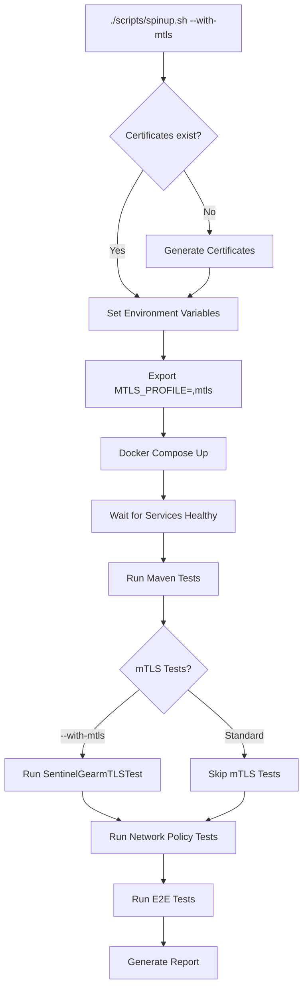

# mTLS Testing Guide

## 🚀 Quick Start: One-Command Testing

### Standard Mode (HTTP)
```bash
./scripts/spinup.sh
```

### mTLS Mode (HTTPS with Mutual TLS)
```bash
./scripts/spinup.sh --with-mtls
```

## 📋 What Happens

### With `--with-mtls` Flag:

1. **Certificate Generation** (if not exists)
   - Generates Root CA (valid 10 years)
   - Creates certificates for all 4 services
   - Creates keystores + truststores (PKCS12 format)
   
2. **Docker Compose Configuration**
   - Mounts `/certs` volume to all services
   - Sets `SPRING_PROFILES_ACTIVE=docker,mtls`
   - Changes healthchecks to HTTPS

3. **Service Startup**
   - All services start with mTLS enabled
   - TLS 1.3/1.2 only
   - Client certificate required (`client-auth: need`)

4. **Test Execution**
   - ✅ Maven Unit Tests (all services)
   - ✅ Certificate Infrastructure Tests (10 tests)
   - ✅ mTLS Integration Tests (7 tests) - **ONLY with --with-mtls**
   - ✅ Network Policy Tests (8 tests)
   - ✅ E2E Alice & Bob Scenario

## 🧪 Test Categories

### Always Run (Standard Mode)
- **Unit Tests**: Business logic, no server required
- **Certificate Infrastructure Tests**: File existence, validity, permissions
- **Network Policy Tests**: Service connectivity (HTTP)
- **E2E Tests**: Full flow validation

### Only with `--with-mtls`
- **mTLS Integration Tests** (`SentinelGearmTLSTest.java`):
  - HTTPS endpoint availability
  - Client certificate requirement
  - Certificate chain validation
  - TLS 1.3 support
  - Service-to-service mTLS

## 📁 File Structure

```
IronBucket/
├── certs/
│   ├── generate-certificates.sh      # Auto-run by spinup.sh --with-mtls
│   ├── ca/
│   │   ├── ca.crt                     # Root CA (10 year validity)
│   │   └── ca.key
│   └── services/
│       ├── sentinel-gear/
│       │   ├── keystore.p12          # Service identity
│       │   ├── truststore.p12        # CA trust
│       │   └── fullchain.crt
│       ├── claimspindel/
│       ├── brazz-nossel/
│       └── buzzle-vane/
│
├── scripts/
│   └── spinup.sh                     # Master script
│
├── steel-hammer/
│   └── docker-compose-steel-hammer.yml  # Services with mTLS support
│
└── services/
    └── Sentinel-Gear/
        ├── src/main/resources/
        │   └── application-mtls.yml  # mTLS configuration
        └── src/test/java/.../
            ├── CertificateInfrastructureTest.java  # Always runs
            ├── SentinelGearmTLSTest.java          # Only with --with-mtls
            └── SentinelGearNetworkPolicyTest.java # Always runs
```

## 🔧 Configuration

### Environment Variables (Set by spinup.sh)

| Variable | Standard Mode | mTLS Mode |
|----------|--------------|-----------|
| `MTLS_PROFILE` | `""` | `",mtls"` |
| `HEALTH_CHECK_PROTOCOL` | `http` | `https` |
| `SPRING_PROFILES_ACTIVE` | `docker` | `docker,mtls` |

### Docker Compose Volumes

```yaml
services:
  steel-hammer-sentinel-gear:
    volumes:
      - ../certs:/certs:ro  # Read-only certificate mount
    environment:
      - "SPRING_PROFILES_ACTIVE=docker${MTLS_PROFILE:-}"
```

## 📊 Test Execution Flow



## 🐛 Troubleshooting

### Services not starting with mTLS

**Check certificates:**
```bash
ls -la certs/services/sentinel-gear/
# Should show: keystore.p12, truststore.p12, tls.crt, tls.key
```

**Regenerate certificates:**
```bash
rm -rf certs/services certs/client certs/ca
./scripts/spinup.sh --with-mtls  # Will auto-generate
```

### Tests failing

**Check service logs:**
```bash
docker logs steel-hammer-sentinel-gear | grep -i "ssl\|tls\|certificate"
```

**Verify mTLS profile active:**
```bash
docker exec steel-hammer-sentinel-gear env | grep SPRING_PROFILES_ACTIVE
# Expected: docker,mtls
```

### Manual testing with curl

**Without client certificate (should fail):**
```bash
curl -k https://localhost:8443/actuator/health
# Expected: SSL certificate problem (client cert required)
```

**With client certificate (should succeed):**
```bash
curl --cacert certs/ca/ca.crt \
     --cert certs/client/client.crt \
     --key certs/client/client.key \
     https://localhost:8443/actuator/health
# Expected: {"status":"UP"}
```

## 📝 Test Reports

Reports are generated in:
```
test-results/
├── logs/
│   └── script-execution.log        # Full spinup log
├── reports/
│   └── comprehensive-report-*.txt  # Test summary
└── artifacts/
    └── test-output-*.log           # Individual test logs
```

## 🎯 Best Practices

1. **Always use `--with-mtls` for production-like testing**
   - Validates real TLS handshakes
   - Tests certificate chain validation
   - Ensures client authentication works

2. **Standard mode for fast iteration**
   - Faster startup (no SSL overhead)
   - Good for business logic testing
   - Use during development

3. **Certificate rotation**
   ```bash
   # Certificates expire after 1 year (services) / 10 years (CA)
   ./certs/generate-certificates.sh --force  # Regenerate all
   ```

4. **CI/CD Integration**
   ```bash
   # In CI pipeline:
   ./scripts/spinup.sh --with-mtls
   # Exit code 0 = all tests passed
   ```

## 🔐 Security Notes

- **Certificates are for TESTING only**
- Default password: `changeit` (stored in scripts)
- Production: Use proper PKI infrastructure
- Never commit private keys to git (already in `.gitignore`)

## 📞 Support

Issues? Check:
1. [TROUBLESHOOTING.md](docs/TROUBLESHOOTING.md)
2. Service logs: `docker-compose -f steel-hammer/docker-compose-steel-hammer.yml logs`
3. Certificate validity: `openssl x509 -in certs/services/sentinel-gear/tls.crt -text -noout`
