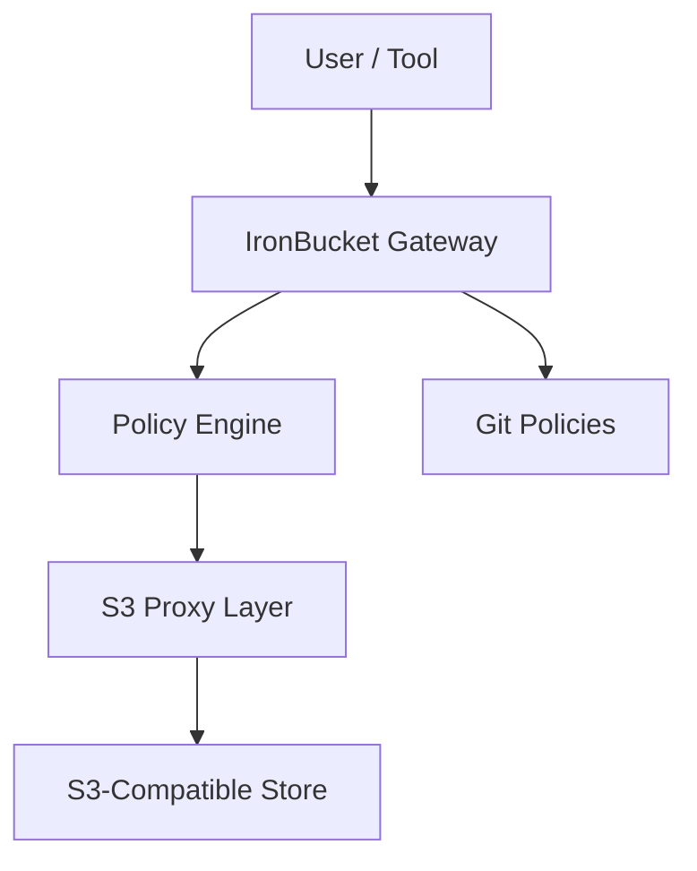

# 🛡️ IronBucket

**IronBucket** is a zero-trust, identity-aware proxy that wraps any S3-compatible object store with Git-managed, policy-as-code access control. Enforce fine-grained permissions using OIDC/OAuth2 identity, attribute-based rules, and GitOps-style auditability.

> 🔐 Secure by default.  
> 🧩 Pluggable with any object store.  
> 🧭 Governed by Git.

---

## � Get Started in 10 Minutes

**👉 [Click here to get started](START.md)** - Complete setup guide with quick start instructions.

---

## 📊 Project Status

> 🗺️ **Navigation**: [START.md](START.md) (quick start) | [DOCS-INDEX.md](DOCS-INDEX.md) (documentation) | [ROADMAP.md](ROADMAP.md) (planning)

### ✅ Phase 1: Core Contracts — COMPLETE

**What was delivered:**
- 📄 **[Identity Model Contract](docs/identity-model.md)** — JWT validation, claim normalization, tenant isolation, service accounts
- 📄 **[Identity Flow Diagram](docs/identity-flow.md)** — Complete request lifecycle, trust boundaries, caching strategy
- 📄 **[Policy Schema Contract](docs/policy-schema.md)** — Policy language, evaluation algorithm, condition types
- 📄 **[S3 Proxy Contract](docs/s3-proxy-contract.md)** — HTTP contract, error model, backend adapters, audit logging
- 📄 **[GitOps Policies Contract](docs/gitops-policies.md)** — Repository structure, validation, deployment workflow
- 📄 **[Phase 2 Test Suite Blueprint](docs/test-suite-phase2.md)** — Comprehensive test specification

**[👉 Read Phase 1 Summary](docs/roadmap/PHASE-1-REVIEW.md)**

### ✅ Phase 2: Comprehensive Test Suite — COMPLETE

✅ All 231 tests passing  
✅ Complete multi-tenant scenario validation (Alice & Bob)  
✅ Docker-based containerized E2E testing

**[📊 See Test Results](docs/testing/TEST-EXECUTION-SUMMARY.md)**

### ✅ Phase 3: Minimal Implementations — COMPLETE

✅ 5 core microservices implemented  
✅ Full E2E testing with Keycloak + MinIO  
✅ Production-ready architecture validated

**[🚀 View Implementation Status](docs/implementation/IMPLEMENTATION-COMPLETE.md)**

### 📈 Phase 4: Continuous Improvement — IN PROGRESS

- ⚡ Performance optimization and caching strategies
- 🏢 High availability and load balancing
- 🔐 Security hardening and threat modeling
- 🧩 Feature expansion (policy dry-run, CLI tools, adapters)

**[📋 See Phase 4 Workstreams](docs/roadmap/PHASE-4-TEST-COVERAGE.md)**

---

## 🧩 What's Strong About IronBucket ✨

| **Aspect** | **Why it matters** |
|-----------|--------------------|
| **GitOps-native policy store** | Treating access rules like code—branches, PRs, rollbacks—pulls security into the engineering workflow. No more brittle IAM JSON or scattered ACLs. |
| **Zero-trust, identity-aware proxy** | By terminating OIDC/OAuth at the gateway, IronBucket decouples identity from the store’s own ACL model and provides a unified RBAC/ABAC layer across S3, MinIO, Ceph, etc. |
| **Drop-in S3 API compatibility** | Keeping the wire protocol untouched means zero rewrites. It works just like Envoy's service mesh adoption playbook. |
| **Clear inspiration from proven OSS projects** | IronBucket borrows branching from Project Nessie and tag-based enforcement from Polaris—standing on solid OSS shoulders rather than inventing in a vacuum. |

---

## 🧠 Open Engineering Challenges (Join the Mission)

🚧 This project is completely new almost no code is written yet. If you’ve ever wanted to help shape something from day zero, **now’s your chance**.

Here are some of the toughest, most rewarding problems waiting for builders like you:

| **Challenge** | **Why it matters & how you could help** |
|---------------|-----------------------------------------|
| ⚙️ **Performance tuning** | Every object fetch includes auth + policy evaluation. Help benchmark latency, optimize in-memory caching, and explore async audit strategies. |
| 🏗️ **High availability (HA)** | A gateway outage shouldn't mean a data outage. Design resilient HA topologies using stateless pods, load balancers, or sidecar approaches. |
| 🛡️ **Policy engine evolution** | Should we use YAML? Rego? Cedar? Help shape the policy language, embed a battle-tested engine, and unlock tooling support. |
| 🏷️ **Metadata & tag enforcement** | ABAC requires clean, immutable tags. Build CLI tools or upload hooks to guarantee metadata consistency and prevent drift. |
| 🏢 **Multi-tenant isolation** | Secure SaaS-style deployments need namespacing, quotas, and noisy-neighbor controls. Architect strong tenant boundaries from the ground up. |

> 💡 Want to leave your mark on open-source data governance? **IronBucket is your forge.**

---

## 🛠️ Quick Wins to Tighten the Story

- 📘 **Publish a threat model**: Diagram trust boundaries (client → gateway → policy engine → store) and highlight mitigations.
- 🧪 **Policy dry-run mode**: Let teams simulate access before merging changes to `main`.
- 💻 **CLI for dev laptops**: A lightweight dev proxy to test policies locally without prod risk.
- 🧩 **Pluggable storage adapters**: Start with S3/MinIO, but leave room for Wasabi, Backblaze, or future targets.
- 🧱 **Roadmapped integrations**: Explicitly support Keycloak/Auth0, GitHub/GitLab, and CI/CD hooks so users know what’s stable.

---


## 🏗️ Architecture Diagram



---

## Proof-of-Concept Snapshot

## 🧵 Identity Flow: End-to-End

1. **User connects** to [`localhost:7085/s3`](http://localhost:7085/s3)
2. **Redirected to Keycloak** for authentication (log in as Bob `dev` or Alice `admin`)
3. **Sentinel-Gear** (OAuth2 client) obtains and sanitizes the access token
4. **Claimspindel** (discovered via **Buzzle-Vane**) **introspects** the JWT using a custom `ClaimsPredicateFactory`
5. **Claimspindel routes** the request:
    - Users with `roles: dev` → `brazz-nossel/dev-controller`
    - Users with `roles: admin` → `brazz-nossel/admin-controller`
6. **Brazz-Nossel** responds with a personalized greeting:  
   - “Hallo dev” or “Hallo admin” depending on identity

---

## 🧩 Features & What We’ve Proven

- **✅ Claims-Driven Routing:** JWT claims are parsed and drive routing decisions
- **✅ Dynamic Discovery:** Buzzle-Vane (Eureka) enables runtime service discovery
- **✅ Trust Boundaries:** Gateways enforce strict trust, no role conflation
- **✅ Route Activation:** Controllers respond only when claims match
- **✅ Policy Segmentation:** Fine-grained access by role
- **✅ Modular Services:** Each service has a clear identity and responsibility
- **✅ Human-Readable Naming:** Every component has a memorable, expressive name

---


## 🗺️ Next Steps

- Expand policy matrix for more granular roles
- Harden trust boundaries
- Add automated tests for claim-based routing
- Extend the “living narrative” with richer identities

> _IronBucket gives your cloud a heartbeat. Identity isn’t just a checkbox—it’s the narrative that connects your services._

## 🧪 Quick Start (Local Dev)

### 🔧 Requirements

- Java 17+
- Docker & Docker Compose
- GitHub/GitLab account
- OIDC provider (Okta, Google, Dex, etc.)
  
---  

## 📜 Writing Policies

IronBucket policies live in Git as YAML or JSON files. They define who can do *what* to *which* resource, under *which* conditions.

```yaml
id: read-access-to-project-x
description: Allow devs to read Project X data
subjects:
  - group: dev-team
actions: [GET, HEAD]
resources:
  - bucket: project-x-data
    prefix: /raw/
conditions:
  - attribute: region
    operator: equals
    value: eu-central-1
```

## 📋 Example Policy Templates

#### 🧪 Read-Only Access for QA Team
```yaml
id: qa-read-access
description: Allow QA team to read test data
subjects:
  - group: qa
actions: [GET, HEAD]
resources:
  - bucket: test-data
    prefix: /
```

#### 🔐 Restricted Upload for Developers (EU Only)

```yaml
id: dev-upload-eu
description: Developers can upload only to EU buckets
subjects:
  - group: dev
actions: [PUT, POST]
resources:
  - bucket: app-logs
    prefix: /dev/
conditions:
  - attribute: region
    operator: equals
    value: eu-central-1
```

#### ❌ Block Public Access
```yaml
id: deny-public-access
description: Explicitly deny anonymous access to all resources
subjects:
  - user: anonymous
actions: [*]
resources:
  - bucket: '*'
    prefix: '/'
effect: deny
```


---

✅ Coming soon:

- Policy testing & validation CLI

- Policy dry-run evaluation

---

## 📂 Project Structure

```
ironbucket/
├── gateway-service/     # OIDC auth, token parsing
├── policy-engine/       # Policy evaluation core
├── s3-proxy/            # S3 API proxy layer
├── audit-service/       # Logs, traces, decisions
├── config/              # Shared secrets, certs, constants
├── infra/               # Docker, GitOps templates
└── docs/                # Guides, diagrams, samples
```
---


### [IronBucket](https://github.com/ZiggiZagga/IronBucket)
**Role:** The umbrella project and central policy engine.  
**Description:**  
- Defines the architecture, APIs, and integration contracts for building identity- and policy-driven systems.
- Coordinates security, routing, and policy enforcement across the ecosystem.
- Serves as the strategic and technical foundation for all subprojects.

---

## Core Subprojects

### [Sentinel-Gear](https://github.com/ZiggiZagga/Sentinel-Gear)
**Role:** Gateway service for authentication and initial policy enforcement.  
**Description:**  
- Acts as the perimeter gateway, providing OpenID Connect (OIDC) authentication and token validation.
- Integrates with IronBucket for policy checks before forwarding requests.
- Entry point for all inbound traffic.

---

### [Claimspindel](https://github.com/ZiggiZagga/Claimspindel)
**Role:** Dynamic JWT gateway and smart routing.  
**Description:**  
- Inspects JWTs at the edge and makes real-time routing decisions based on identity claims (region, role, tenant, etc).
- Enforces fine-grained, claim-based access policies before requests reach core services.
- Works with Sentinel-Gear and IronBucket for layered security.

---

### [Buzzle-Vane](https://github.com/ZiggiZagga/Buzzle-Vane)
**Role:** Eureka-based identity-aware service discovery.  
**Description:**  
- Registers and discovers services within the ecosystem.
- Guides traffic toward the appropriate service instances based on identity, region, and dynamic policy.
- Ensures context-aware service resolution.

---

### [Brazz-Nossel](https://github.com/ZiggiZagga/Brazz-Nossel)
**Role:** Identity-aware S3 Proxy.  
**Description:**  
- Acts as a secure, policy-enforcing proxy for S3-compatible object storage.
- Applies identity-driven access controls to S3 operations (GET, PUT, etc).
- Enables unified policy and identity for both API/service traffic and object storage.

---

## Minimal Working Example: Quickstart Guide

Follow these steps to spin up a minimal working demo of the IronBucket ecosystem:

1. **Clone All Repositories**
   ```sh
   git clone https://github.com/ZiggiZagga/IronBucket.git
   git clone https://github.com/ZiggiZagga/Sentinel-Gear.git
   git clone https://github.com/ZiggiZagga/Claimspindel.git
   git clone https://github.com/ZiggiZagga/Buzzle-Vane.git
   git clone https://github.com/ZiggiZagga/Brazz-Nossel.git
   ```

2. **Start Core Identity and Policy Services**
   - Navigate to the steel-hammer folder inside the IronBucket repository:
     ```sh
     cd IronBucket/steel-hammer
     ```
   - Environmentvariables:     
     ```sh
     pwd
     ```
     Put the path into the double exports below and export the variable `DOCKER_FILES_HOMEDIR`.
      ```sh
     export DOCKER_FILES_HOMEDIR=""
     ```
   - Launch Keycloak (on port 7081) and Postgres (on port 5432) via Docker Compose:
     ```sh
     docker compose -f docker-compose.yml up --build
     ```
   - Wait for the services to start.  
   - Verify that Keycloak is running by navigating to [http://localhost:7081](http://localhost:7081) in your browser.
     

3. **Start the Java Applications in your IDE (in order):**
   - before you can run the Java Applications you have to make sure they all have access to the following environment variables:
     ```sh
     export IDP_PROVIDER_HOST="localhost:7081"
     export IDP_PROVIDER_PROTOCOL="http"
     export IDP_PROVIDER_REALM="dev"
     ```
   - Start **[Buzzle-Vane](https://github.com/ZiggiZagga/Buzzle-Vane)**
   - Start **[Sentinel-Gear](https://github.com/ZiggiZagga/Sentinel-Gear)**
   - Start **[Claimspindel](https://github.com/ZiggiZagga/Claimspindel)**
   - Start **[Brazz-Nossel](https://github.com/ZiggiZagga/Brazz-Nossel)**

   *(You need to do this in your favorite IDE.)*

4. **Verify the Setup**
   - Open [http://localhost:7085/s3](http://localhost:7085/s3) to access the Sentinel-Gear endpoint.
   - You should be redirected to the Keycloak login page.

5. **Test Users**
   The system comes preconfigured with two example users:
   | Username | Role  | Password   |
   |----------|-------|------------|
   | bob      | dev   | bobP@ss    |
   | alice    | admin | aliceP@ss  |

---


## **Goto Production fast strategy**

### 🧬 From **[Project Nessie](https://github.com/projectnessie/nessie)**
**Git-style branching & commit semantics**  
- ✳️ _Inspiration_: Nessie’s Git-like model for data  
- ✅ _How we use it_: Apply similar mechanics to version **access control policies**—supporting policy branches (`dev`, `stage`, `prod`), commit logs, and rollback

**Commit metadata & audit**  
- ⛏️ _Inspiration_: Nessie tracks user actions across branches  
- ✅ _IronBucket fit_: Record "who edited what" in policy changes for traceability

---

### 🛡️ From **[Apache Polaris](https://github.com/apache/polaris)**
**Fine-grained permissions + federation model**  
- ✳️ _Inspiration_: Polaris has multi-tenant RBAC and federated query layers  
- ✅ _IronBucket fit_: Adapt its role definition granularity and hierarchical access controls for **multi-project S3 namespaces**

**Attribute-tag-aware enforcement**  
- ⛏️ _Inspiration_: Data tags + policy enforcement at query time  
- ✅ _IronBucket fit_: We apply tags to objects and enforce ABAC rules at access time (e.g., `user.region == object.tag.region`)

---

### 🧭 From **[Unity Catalog](https://github.com/unitycatalog/unitycatalog)** (conceptual since it’s closed-source)
**Centralized governance with identity awareness**  
- ✳️ _Inspiration_: Global identity-based permissions across workspaces  
- ✅ _IronBucket fit_: Global RBAC/ABAC rule definitions, synced across services via Git, linked to real identity provider attributes

**Lineage-as-a-feature**  
- While full lineage isn’t core to us, we _could_ log object usage and produce lineage-style metadata for access—for audit or downstream triggers

---

### 🚀 From **[Gravitino](https://github.com/apache/gravitino)**
**Schema-level metadata & governance layer**  
- ✳️ _Inspiration_: Gravitino abstracts metadata across catalogs  
- ✅ _IronBucket fit_: Although we’re staying out of table land, **Gravitino’s catalog of governance objects** could inspire our **policy object model**—defining storage buckets, roles, and constraints in a unified structure

---

### 🧩 Synthesis for IronBucket
If we align all that into our domain, here's what we'd implement:
- Git-backed policy store with Nessie-like branches and commits
- Attribute-driven access control via Polaris-style tags + ABAC
- Unified identity layer inspired by Unity Catalog, aware of OIDC roles, groups, entitlements
- Governance object graph modeled a bit like Gravitino, but constrained to buckets, prefixes, and roles—not tables or schemas

---

---

🤝 Contributing
We love contributors! Check out CONTRIBUTING.md and browse our open issues.

---

📝 License


---

🌐 Community
💬 Discussions

🧵 Slack/Discord – coming soon

---
