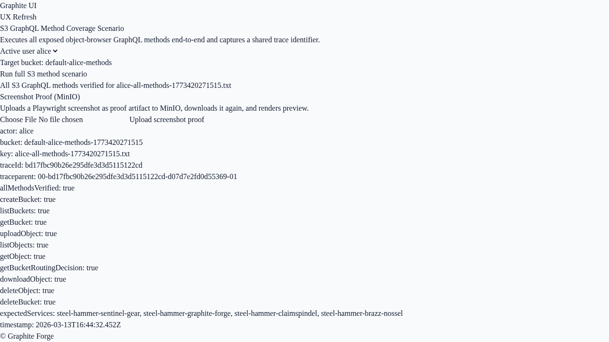

# IronBucket

Production-ready S3-compatible microservices platform with JWT authentication, multi-tenant support, and policy-based routing.

## 🚨 Production Readiness Status

**Current Status**: 🟢 **Core Build/Test Gates Green** | 🟡 **Operational Hardening Active**

IronBucket has validated Java test baselines and roadmap/behavioral gates, with ongoing hardening focused on release governance and production operations.

| Component | Status | Notes |
|-----------|--------|-------|
| Architecture | ✅ A+ | Zero-trust design, excellent |
| Code Quality | ✅ A | Modern Java 25, Spring Boot 4 |
| Tests | ✅ A | Backend suites and Sentinel gates passing |
| CI/CD | ✅ A- | Build, roadmap, behavioral, and provenance pipelines active |
| Security Design | ✅ A+ | Zero-trust, multi-layer |
| **Network Isolation** | 🔴 **C** | **NetworkPolicies required** |
| **Credential Mgmt** | 🔴 **D** | **Vault integration needed** |
| Observability | 🟡 B | Logs/Metrics operational; tracing hardening active |

**⚠️ Remaining production actions:**
1. Enforce required branch checks and release preflight in protected-branch policy
2. Finalize presigned-secret rotation/runbook rollout
3. Complete platform-level hardening items in [ROADMAP.md](ROADMAP.md)
4. Complete [security hardening](docs/security/MINIO-ISOLATION-AUDIT.md)

**📋 See**: [Production Readiness Roadmap](docs/PRODUCTION-READINESS-ROADMAP.md) | [Roadmap](ROADMAP.md)

---

## Quick Start

### Prerequisites
- Docker & Docker Compose  
- Java 25+  
- Maven 3.9+  

### Run Locally
```bash
# First-time full validation (cold-start friendly)
bash scripts/run-all-tests-complete.sh

# Optional: infrastructure-only startup
cd steel-hammer
docker-compose -f docker-compose-steel-hammer.yml up -d --build
```

**Result:** End-to-end orchestrator runs Maven suites + infrastructure checks + full E2E + observability proof and writes reports to `test-results/`.

## What Pain IronBucket Solves (Real-World Examples)

IronBucket exists to remove common, expensive storage and access-control pain in teams.

- "I just need secure file storage, but setting up S3 auth is too complex."
  IronBucket provides a single path for JWT-based authentication and S3-compatible access.
- "One customer should never see another customer's files."
  IronBucket enforces tenant-aware routing and policy checks before object access.
- "Our audit/compliance review failed because access decisions were not traceable."
  IronBucket integrates metadata + observability evidence so decisions can be tracked and verified.
- "Different services implement storage rules differently, and bugs keep recurring."
  IronBucket centralizes auth, policy evaluation, and routing so teams stop re-implementing security logic.
- "We need cloud-like object storage on-prem without vendor lock-in."
  IronBucket runs with MinIO and standard S3 semantics, enabling portable deployments.

In short: IronBucket turns storage access from ad-hoc app logic into a consistent, testable platform control plane.

## Features

- **S3-Compatible API** - Full AWS S3 compatibility for object storage
- **JWT Authentication** - Secure HMAC-SHA256 token validation  
- **Multi-Tenant** - Policy-based access control per tenant
- **Service Discovery** - Eureka-based microservice registration
- **PostgreSQL Metadata** - Transactional audit logging
- **MinIO Storage** - On-premise S3-compatible storage
- **Containerized** - Docker Compose for local & production
- **CI/CD Pipeline** - Automated builds, tests, security scans, SLSA provenance
- **Supply-Chain Security** - SLSA Build Level 3 compliance

## Architecture

```
Client Request
  ↓
Brazz-Nossel (S3 Proxy) :8082
  ↓ [JWT Required]
Sentinel-Gear (JWT Validator) :8080
  ↓
Claimspindel (Policy Router) :8081
  ↓
MinIO (S3 Storage) :9000
  ↓
PostgreSQL (Metadata)
```

**Discovery:** Buzzle-Vane (Eureka) :8083  
**Identity:** Keycloak :8080

## Documentation

### 🔐 Security & Production Readiness (⚠️ START HERE)

| Document | Purpose | Priority |
|----------|---------|----------|
| [Production Readiness Roadmap](docs/PRODUCTION-READINESS-ROADMAP.md) | **Implementation plan & operational hardening roadmap** | 🔴 CRITICAL |
| [Production Readiness Roadmap](ROADMAP.md) | **Implementation plan & timeline** | 🔴 CRITICAL |
| [MinIO Isolation Audit](docs/security/MINIO-ISOLATION-AUDIT.md) | **Network security analysis** | 🔴 CRITICAL |
| [K8s NetworkPolicies](docs/k8s-network-policies.yaml) | **Network isolation rules** | 🔴 DEPLOY FIRST |
| [Sentinel-Gear Security](docs/security/SENTINEL-CLAIMSPINDEL-SECURITY-VALIDATION.md) | Zero-trust validation | High |

### 📚 User Guides

| Document | Purpose |
|----------|---------|
| [GETTING_STARTED.md](docs/GETTING_STARTED.md) | Complete setup guide for users |
| [ARCHITECTURE.md](docs/ARCHITECTURE.md) | System design, service interaction |
| [DEPLOYMENT.md](docs/DEPLOYMENT.md) | Production deployment guide |
| [TROUBLESHOOTING.md](docs/TROUBLESHOOTING.md) | Common issues & solutions |
| [API.md](docs/API.md) | S3 API compatibility |

### 🔧 Developer Guides

| Document | Purpose |
|----------|---------|
| [TESTING-QUICK-START.md](docs/testing/TESTING-QUICK-START.md) | **Comprehensive test execution quick start** |
| [CI-CD-PIPELINE.md](docs/CI-CD-PIPELINE.md) | CI/CD, security scanning, SLSA provenance |
| [CONTRIBUTING.md](docs/CONTRIBUTING.md) | Developer guidelines |
| [REFACTOR-AND-TEST-PLAN-2026-03-12.md](docs/testing/REFACTOR-AND-TEST-PLAN-2026-03-12.md) | Testing and validation work plan |

## Test Results

✅ **Core module test pathways passing** (latest comprehensive run)  
✅ **Sentinel roadmap and behavioral implementation-gate profiles passing**

### Run Comprehensive Tests

```bash
# Run all tests with comprehensive reporting
bash scripts/comprehensive-test-reporter.sh --all

# Run specific test types
bash scripts/comprehensive-test-reporter.sh --backend  # Maven only
bash scripts/comprehensive-test-reporter.sh --e2e      # E2E only
bash scripts/comprehensive-test-reporter.sh --security # Security only

# View results
cat test-results/reports/LATEST-SUMMARY.md
```

### Test Breakdown

| Module | Tests | Status |
|--------|-------|--------|
| Brazz-Nossel (S3 Proxy) | 47 | ✅ |
| Sentinel-Gear (JWT Validator) | 44 | ✅ |
| Claimspindel (Policy Router) | 72 | ✅ |
| Buzzle-Vane (Service Discovery) | 58 | ✅ |
| Storage-Conductor | 10 | ✅ |
| **Security Validation** | 4 | ✅ |

**Release preflight (recommended before tagging):**

```bash
bash scripts/ci/release-preflight.sh

# Optional: include full orchestrator validation
RUN_FULL_ORCHESTRATOR=true bash scripts/ci/release-preflight.sh

# Optional: enforce strict branch-protection verification (requires admin token)
GITHUB_TOKEN=<admin_token> BRANCH_PROTECTION_STRICT=true bash scripts/ci/release-preflight.sh
```

See [TESTING-QUICK-START.md](docs/testing/TESTING-QUICK-START.md) for details.

## E2E Verification (Production Ready)

From clean Docker environment:
- ✅ All 9 containers building and running
- ✅ File upload to MinIO successful (48 bytes)
- ✅ File retrieval from MinIO successful
- ✅ JWT authentication enforced (HTTP 401)
- ✅ Complete S3 API compatibility verified

See [E2E-QUICKSTART.md](docs/E2E-QUICKSTART.md), [E2E-OBSERVABILITY-GUIDE.md](docs/E2E-OBSERVABILITY-GUIDE.md), and [OBSERVABILITY-FEATURESET-STATUS.md](docs/OBSERVABILITY-FEATURESET-STATUS.md) for details.

## Observability Runtime Status (2026-03-13)

- Logs (Loki): ✅ operational
- Metrics (Mimir): ✅ operational
- Traces (Tempo): ⚠️ degraded (container restart loop caused by Kafka-topic distributor config mismatch)

Latest UI evidence artifacts:
- `test-results/ui-e2e-traces/ui-live-upload-persistence.json`
- `test-results/ui-e2e-traces/ui-s3-methods-e2e.json`
- `test-results/ui-e2e-traces/ui-s3-methods-proof.png`

Screenshot proof (live UI E2E):



## Components

**Brazz-Nossel** - S3 Proxy Gateway (Port 8082)
- HTTP proxy for S3-compatible storage
- Enforces JWT authentication

**Sentinel-Gear** - JWT Validator (Port 8080)
- OpenID Connect authentication
- JWT validation with HMAC-SHA256
- Token claim extraction

**Claimspindel** - Policy Router (Port 8081)
- Policy evaluation based on JWT claims
- Dynamic routing decisions
- Multi-tenant support

**Buzzle-Vane** - Service Discovery (Port 8083)
- Eureka-based service registration
- Dynamic service resolution

**MinIO** - S3-Compatible Storage (Port 9000)
- Object storage with S3 API
- Bucket management
- File persistence

**PostgreSQL** - Metadata Persistence
- Audit logging
- Transaction records
- Policy metadata

**Keycloak** - Identity Provider (Port 8080)
- OIDC authentication
- User & role management

## Status

**Production Validation Baseline** ✅

Core components, Java suites, and Sentinel roadmap/behavioral gates are green; operational hardening continues per roadmap.

Latest release details: [Release Notes v1.2.8](docs/RELEASE-NOTES-v1.2.8.md)

## License

Project licensing details are currently documented through repository governance and release policy documents.

## Contributing

See [CONTRIBUTING.md](docs/CONTRIBUTING.md)
